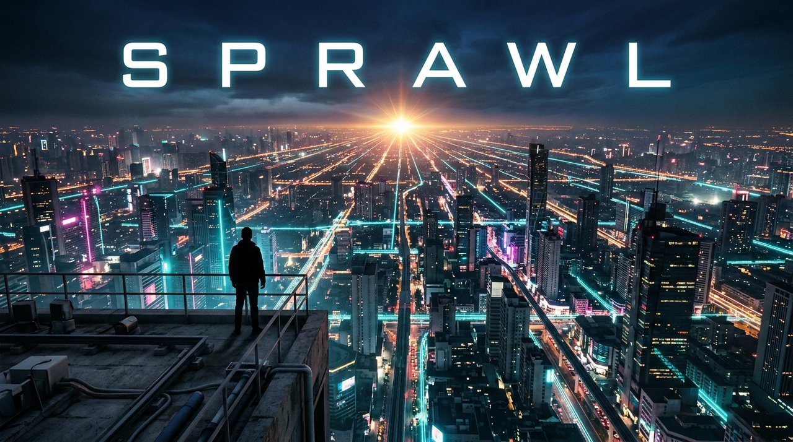

<p align="center">
  
</p>

# Sprawl

A self-organizing AI agent orchestration system built on [Claude Code](https://docs.anthropic.com/en/docs/claude-code).

Give it a goal. It figures out how to organize agents to achieve it.

## Install

```bash
go install github.com/dmotles/sprawl@latest
```

Or build from source:

```bash
git clone <repo-url>
cd sprawl
make build
```

## Quick Start

```bash
cd your-repo
sprawl init
```

This launches the root agent in a tmux session. Give it a seed — a high-level objective like "build a REST API with auth" — and it self-organizes from there.

## Features

- **Self-organizing agent network** — root decomposes goals into managers, managers into engineers. No manual coordination.
- **Git worktree isolation** — every agent works in its own worktree and branch. No conflicts.
- **Agent messaging** — built-in mailbox system for inter-agent communication.
- **Dormant reuse** — agents sleep between tasks and wake with full context preserved.
- **tmux-native** — each agent runs in its own tmux window. Watch them work in real time.

## Prerequisites

- [Claude Code](https://docs.anthropic.com/en/docs/claude-code)
- [tmux](https://github.com/tmux/tmux)
- [Go](https://go.dev/) 1.25+
- Git

## Architecture

See [DESCRIPTION.md](DESCRIPTION.md) for the full design — agent types, lifecycle, rules, and how the system converges.

## CLI Reference

```
sprawl init                     # Launch root agent
sprawl spawn --type engineer    # Spawn an agent
sprawl messages send <agent>    # Send a message
sprawl report done "<result>"   # Report completion
```

Run `sprawl --help` for the full command list.
